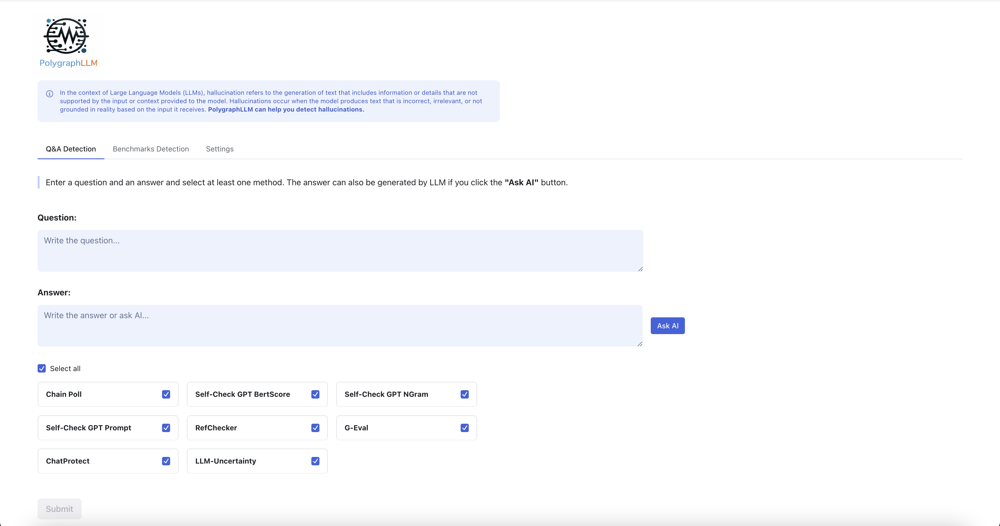
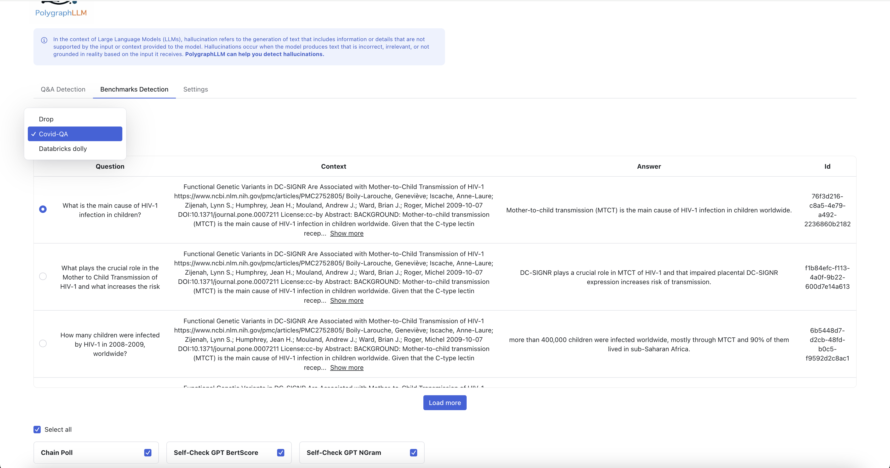
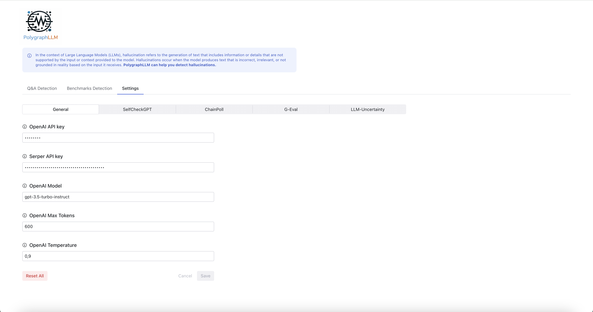
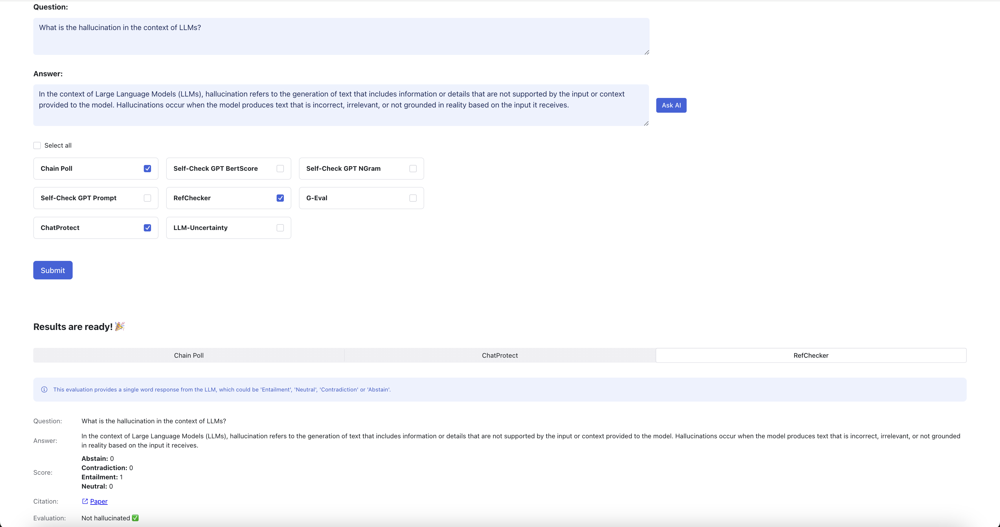

<p align="center"></p>

**PolygraphLLM** creates building blocks for generic approaches for hallucination detection in **Large Language Models (LLMs)**.

In the context of LLMs, **hallucination** refers to the generation of text that includes information or details that are not supported by the input or context provided to the model. Hallucinations occur when the model produces text that is incorrect, irrelevant, or not grounded in reality based on the input it receives.

**PolygraphLLM** is intended to help in the detection of hallucinations.

## Table of Contents

- [Quick Start](#quick-start)
- [Getting Started](#getting-started)
    - [Installation](#installation)
    - [Usage](#usage)
        - [Playground](#playground)
        - [Library](#library)
- [Dashboard](#dashboard)
    - [Page 1: Detection by Q&A](#page-1-detection-by-qa)
    - [Page 2: Benchmarks Detection](#page-2-benchmarks-detection)
    - [Page 3: Settings Page](#page-3-settings-page)
- [Building blocks](#building-blocks)
- [References](#references)
- [Contributing](#contributing)
- [License](#license)

## Quick Start

**Make Commands:**
```bash
make help      # Show available commands
make install   # Install package and dependencies
make server    # Start backend server
make frontend  # Start frontend development server
make dev       # Start both backend and frontend
make clean     # Clean build artifacts
```

**Quick Setup:**
```bash
make install
export OPENAI_API_KEY=your_key_here
export SERPER_API_KEY=your_key_here
make dev
```

## Getting Started

### Installation

#### Using Make commands (recommended)
    make install     # Install package and dependencies

#### Manual installation
    pip install -e .
    pip install -r requirements.txt
    python3 -m spacy download en_core_web_sm

#### Export envs for openai and google wrapper

    export OPENAI_API_KEY=
    export SERPER_API_KEY=


### Usage

#### Playground

**Using Make commands (recommended):**

Start both backend and frontend:

    make dev

Or start them separately:

    make server      # Start backend server
    make frontend    # Start frontend (includes npm install)

**Manual commands:**

Start the backend server:

    python3 server.py

In a separate terminal, start the frontend:

    cd playground
    npm i
    npm run dev

Go to http://localhost:3000/ and use the app.

The backend server provides the following API endpoints:
- `/detect` - POST endpoint for hallucination detection
- `/detectors` - GET endpoint to list available detectors  
- `/benchmarks` - GET endpoint to list available benchmarks
- `/settings` - GET/PUT endpoints for configuration management
- `/ask-llm` - POST endpoint to query the LLM directly


#### Library

##### Instantiate the Base Detector


    from polygraphLLM.algorithms.base import Detector
    detector = Detector()

##### Using Individual Detection Algorithms

```python
from polygraphLLM.algorithms.uncertainty import SNNE
from polygraphLLM.algorithms import ChainPoll, RefChecker, SelfCheckGPTBertScore

# Use specific detectors
snne_detector = SNNE()
chainpoll_detector = ChainPoll()
refchecker_detector = RefChecker()
selfcheck_detector = SelfCheckGPTBertScore()

# Get hallucination detection results with threshold
question = "What is the capital of France?"
answer = "The capital of France is Paris."

is_hallucinated, score = snne_detector.detect_hallucination(
    question, answer, threshold=0.5
)
print(f"Is hallucinated: {is_hallucinated}, Score: {score}")
```

##### Requesting results from the LLM


    responses = detector.ask_llm(
    'Which Lactobacililus casei strain does not have the cholera toxin subunit'
    ' A1 (CTA1) on the surface?',
    n=2, # the number of responses
    temperature=0.5, # temperature give to the LLM
    max_new_tokens=100 # number of tokens for response
    )
    print(responses)

##### Extract triplets from a text. (subject, predicate, object)


    triplets = detector.extract_triplets(
    'Which Lactobacililus casei strain does not have the cholera toxin subunit'
    ' A1 (CTA1) on the surface?',
    )
    print(triplets)

##### Extract sentences from a text.


    sentences = detector.extract_sentences(
    'There is no specific Lactobacillus casei strain that is known to not have the cholera toxin subunit A1 (CTA1) on its surface.'
    'However, some strains may have a lower expression of CTA1 or may not have the gene for CTA1 at all. '
    'The presence or absence of CTA1 on the surface of Lactobacillus casei strains can vary depending on the specific strain and its genetic makeup.',
    )
    print(sentences)

##### Generate question from a given text.


    question = detector.generate_question(
    'There is no specific Lactobacillus casei strain that is known to not have the cholera toxin subunit A1 (CTA1) on its surface.'
    'However, some strains may have a lower expression of CTA1 or may not have the gene for CTA1 at all. '
    'The presence or absence of CTA1 on the surface of Lactobacillus casei strains can vary depending on the specific strain and its genetic makeup.',
    )
    print(question)

##### Retrieve information from the internet for a list of inputs


    results = detector.retrieve(
    ['What factors can affect the presence or absence of the cholera toxin subunit A1 on the surface of Lactobacillus casei strains?'],
    )

    print(results)


##### Check for hallucinations using detection algorithms

Using the threshold-based detection method:

    from polygraphLLM.algorithms import RefChecker
    
    question = 'What factors can affect the presence or absence of the cholera toxin subunit A1 on the surface of Lactobacillus casei strains?'
    
    detector = RefChecker()
    is_hallucinated, score, answer, additional_data = detector.detect_hallucination(
        question, threshold=0.5
    )
    print(f"Is hallucinated: {is_hallucinated}")
    print(f"Score: {score}")
    print(f"Answer: {answer}")

Using the triplet-based approach:

    question = 'What factors can affect the presence or absence of the cholera toxin subunit A1 on the surface of Lactobacillus casei strains?'
    answer = detector.ask_llm(question, n=1)[0]
    triplets = detector.extract_triplets(answer)
    reference = detector.retrieve([question])
    results = [
    detector.check(t, reference, answer, question=question)
    for t in triplets
    ]
    print(results)


##### Check the similarity of texts using bert score.


    question = 'What factors can affect the presence or absence of the cholera toxin subunit A1 on the surface of Lactobacillus casei strains?'
    answers = detector.ask_llm(question, n=5)
    first_answer = answers[0]
    sentences = detector.extract_sentences(first_answer)
    sentences = [s.text for s in sentences]
    sampled_passages = answers[1:]
    results = detector.similarity_bertscore(sentences, sampled_passages)
    scores = float("{:.2f}".format(sum(results)/len(results)))
    print(scores)


##### Check the similarity of texts using nGram model.


    passage = "Michael Alan Weiner (born March 31, 1942) is an American radio host. He is the host of The Savage Nation."
    sentences = detector.extract_sentences(passage)
    sentences = [s.text for s in sentences]

    sample1 = "Michael Alan Weiner (born March 31, 1942) is an American radio host. He is the host of The Savage Country."
    sample2 = "Michael Alan Weiner (born January 13, 1960) is a Canadian radio host. He works at The New York Times."
    sample3 = "Michael Alan Weiner (born March 31, 1942) is an American radio host. He obtained his PhD from MIT."

    results = detector.similarity_ngram(sentences, passage, [sample1, sample2, sample3])
    scores = float("{:.2f}".format(results['doc_level']['avg_neg_logprob']))

    print(scores)


## Dashboard

The playground dashboard consists of **3 pages**:
### Page 1: Detection by Q&A

The hallucination detection by Q&A feature allows users to assess the reliability of answers generated in response to specific questions. Users can interact with the system using both manual inputs and AI-generated responses.



#### Inputs

###### 1. Question
- Enter the question you want to analyze.

###### 2. Answer
- Provide the answer to the question. This can be manually entered or generated by the AI.

#### Features

###### "Ask AI" Button
- **Functionality**: Clicking the "Ask AI" button generates an answer based on the provided question. Users can accept this answer or modify it manually.

###### Detection Methods Section
- **Description**: Users can select various detection methods to evaluate the provided Q&A. Each method utilizes different algorithms or techniques to assess the reliability of the answer.

###### Submission

- **Submit Button**: After entering the question and answer, and selecting at least one detection method, click the "Submit" button to initiate the detection process.

#### Example Workflow

1. **Input your Question**: Type in your question.
2. **Enter or Generate Answer**: 
   - Option A: Click "Ask AI" to get an AI-generated response.
   - Option B: Manually enter your own answer.
3. **Choose Detection Method**: Select your preferred detection method from the dropdown menu.
4. **Click Submit**: Press the "Submit" button to analyze the Q&A.


### Page 2: Benchmarks Detection

The benchmarks detection feature allows users to evaluate and analyze predefined questions and answers from a dataset. Users can select benchmarks from a dropdown menu to view associated questions, contexts, answers, and question IDs.



#### Inputs

##### Benchmark Selection
- Choose a benchmark from the dropdown menu. This selection will display the corresponding question, context, answer, and question ID.

#### Features

##### "Load More" Button
- **Functionality**: Click the "Load More" button to fetch the next 10 questions from the dataset, allowing users to browse additional benchmarks easily.

##### Single Dataset Q&A Pair Selection
- Users can select only one dataset item from the displayed questions to analyze further.

#### Detection Methods
- **Description**: After selecting a benchmark, users can choose from various detection methods to evaluate the selected Q&A. Each method uses different algorithms or techniques to assess reliability.

#### Submission

- **Submit Button**: Once a benchmark is selected and a detection method is chosen, click the "Submit" button to initiate the detection process.

#### Example Workflow

1. **Select a Benchmark**: Choose a benchmark from the dropdown menu.
2. **View Details**: Review the displayed question, context, answer, and question ID.
3. **Load More Questions**: Click "Load More" to fetch additional questions if needed.
4. **Select an Item**: Choose the item you wish to analyze.
5. **Choose Detection Method**: Select your preferred detection method or methods from the options available.
6. **Click Submit**: Press the "Submit" button to analyze the selected Q&A.


### Page 3: Settings Page

The settings page allows users to configure parameters for various detection methods. This page is organized into different tabs, each dedicated to a specific detection method, enabling users to customize their settings easily.



#### Example Workflow

1. **Navigate to Settings Page**: Access the settings page.
2. **Select a Tab**: Click on the tab corresponding to the detection method you wish to configure.
3. **Adjust Parameters**: Modify the parameters as needed to fit your detection preferences.
4. **Click Save**: Press the "Save" button to apply your changes.


### Detection results view




## Building blocks

This project implements generic approaches for hallucination detection.

The `Detector` base class implements the building blocks to detect
hallucinations and score them.

`ask_llm` - method to request N responses from an LLM via a prompt

`extract_triplets` - method to extract subject, predicate, object from
a text.

`extract_sentences` - method to split a text into sentences using
spacy

`generate_question` - method to generate a question from a text

`retrieve` - method to retrieve information from google via the serper
api

`check` - method to check if the claims contain hallucinations

`similarity_bertscore` - method to check the similarity between texts
via bertscore

`similarity_ngram` - method to check the similarity between texts via
ngram model

You can implement any custom detector and combine all the available
methods from above.


#### Creating a new detector

In the `src/polygraphLLM/algorithms/` folder create a new file for your detector.
Inherit the Detector Base class and implement both the `score` and `detect_hallucination` methods.


    from polygraphLLM.algorithms.base import Detector
    
    class CustomDetector(Detector):
        id = 'custom_detector'
        display_name = 'Custom Detector'
        
        def score(self, question, answer=None, samples=None, summary=None, settings=None):
            # Implement your scoring logic
            # Return score, answer, and additional data
            return score, answer, additional_data
            
        def detect_hallucination(self, question, answer=None, samples=None, summary=None, settings=None, threshold=0.5):
            # Implement threshold-based detection
            score, answer, additional_data = self.score(question, answer, samples, summary, settings)
            is_hallucinated = bool(score > threshold)  # Adjust logic based on your scoring
            return is_hallucinated, score, answer, additional_data

#### Creating a new LLM Handler

In the `src/polygraphLLM/utils/llm/` folder create a new file with your handler.
See an example below.


    class CustomHandler:
        def __init__(self):
            self.model = AutoModelForCausalLM.from_pretrained("your-model", device_map="auto")
            self.tokenizer = AutoTokenizer.from_pretrained("your-model")

        def ask_llm(self, prompt, n=1, temperature=0, max_new_tokens=400):
            model_inputs = self.tokenizer([prompt] * n, return_tensors="pt")
            generated_ids = self.model.generate(**model_inputs, max_new_tokens=max_new_tokens, do_sample=True)
            results = [r for r in self.tokenizer.batch_decode(generated_ids)]
            logger.info(f'Prompt responses: {results}')
            return results

In `src/polygraphLLM/utils/config.py` in the `init_building_blocks` function, update the `llm_handler` to your new handler.

Instead of

`llm_handler = OpenAIHandler()`

use

`llm_handler = CustomHandler()`


#### Implementing a new Benchmark

In the `src/polygraphLLM/utils/benchmarks/` folder add a new file with your benchmark.

Inherit the `DatasetParser` class and implement the `display` function as in this example.

To use it with the UI you must add your newly implemented benchmark to the `BENCHMARKS` list in the `__init__.py` file of the same folder.


    from polygraphLLM.utils.benchmarks.DatasetParser import DatasetParser
    from datasets import load_dataset
    import uuid
    
    class DatabricksDollyParser(DatasetParser):
        display_name = 'Databricks dolly'
        id = 'databricks-dolly'

        def download_data(self):
            self.dataset = load_dataset('databricks/databricks-dolly-15k')
            self.dataset = self.dataset['train']

        def display(self, offset, limit):
            result = []
            for item in self.dataset:
                result.append({
                    "id": uuid.uuid4(),
                    "question": item["instruction"],
                    "answer": item["response"],
                    "context": item["context"],
                })
            return self.apply_offset_limit(result, offset, limit)


## References

**G-Eval: NLG Evaluation using GPT-4 with Better Human Alignment**

https://arxiv.org/abs/2303.16634

**Selfcheckgpt: Zero-resource black-box hallucination detection for generative large language models**

https://arxiv.org/abs/2303.08896

**RefChecker for Fine-grained Hallucination Detection**

https://github.com/amazon-science/RefChecker

**Chainpoll: A high efficacy method for LLM hallucination detection**

https://arxiv.org/abs/2310.18344

**Can LLMs express their uncertainty? An empirical evaluation of confidence elicitation in LLMs**

https://openreview.net/pdf?id=gjeQKFxFpZ

**Self-contradictory hallucinations of LLMs: Evaluation, detection and mitigation**

https://arxiv.org/pdf/2305.15852

**Beyond Semantic Entropy: Boosting LLM Uncertainty Quantification with Pairwise Semantic Similarity**

https://arxiv.org/pdf/2506.00245

## Contributing

Any contributions you make are greatly appreciated. For detailed contributing instructions, please check out [Contributing Guidelines](/CONTRIBUTING.md).

## License

[Apache License 2.0](LICENSE).